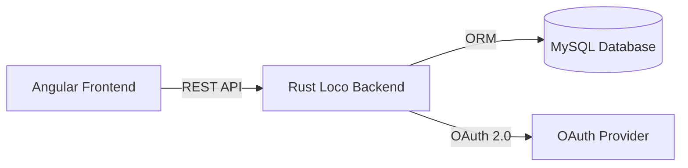
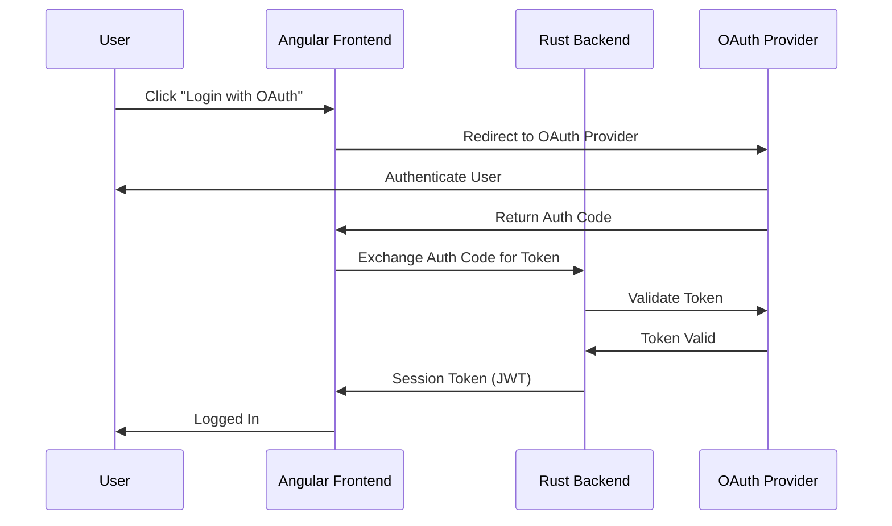

# Working Space Booking System

A full-stack **workspace booking management system** built with **Rust (Loco + SeaORM)** on the backend, **Angular** for the frontend, **Bootstrap** for UI styling, **MySQL** for database storage, and **OAuth** for secure login.

---

## Features

- **Workspace Booking**: Users can browse, book, and manage workspaces.
- **Authentication & Authorization**: OAuth-based secure login (e.g., Google, GitHub).
- **Modern UI**: Built with Angular and styled using Bootstrap.
- **Database Integration**: Uses MySQL as the primary data store.
- **Rust Backend**:
  - **Loco** framework for robust API development.
  - **SeaORM** for database ORM and query management.
- **RESTful API**: Well-structured endpoints for frontend-backend communication.

---

## Tech Stack

- **Backend**: Rust, [Loco](https://github.com/loco-rs/loco), [SeaORM](https://www.sea-ql.org/SeaORM/)
- **Frontend**: Angular, Bootstrap
- **Database**: MySQL
- **Authentication**: OAuth (Authentik/custom)

---

## Architecture

OAuth Flow

⸻

Project Structure

workingspace_booking_system/
├── src/               # Rust Loco + SeaORM API
├── frontend/          # Angular + Bootstrap UI
├── migration/         # MySQL schema and migrations
└── README.md

⸻

Installation & Setup

Prerequisites
	•	Rust (latest stable)
	•	Node.js & npm
	•	MySQL server
	•	OAuth credentials from your provider

Steps
	1.	Clone Repository

git clone https://github.com/Martin1088/workingspace_booking_system.git
cd workingspace_booking_system

	2.	Backend Setup

cargo loco start

	3.	Frontend Setup

cd ../frontend
npm build

	4.	Database
	•	Create a MySQL database and update connection details in config/development.yaml configuration.
	•	Run migrations (SeaORM).
	5.	OAuth
	•	Configure OAuth credentials in config/development.yaml .env.

⸻

Docker Setup (Optional)

Prerequisites
	•	Docker
	•	Docker Compose

Run with Docker Compose

docker-compose up --build

This will start:
	•	Rust backend API
	•	Angular frontend
	•	MySQL database

Update .env files before running.

⸻

API Endpoints (Sample)
	•	POST /auth/login - OAuth login
	•	GET /
	•	POST /
	•	GET /

⸻

License

MIT License

---

