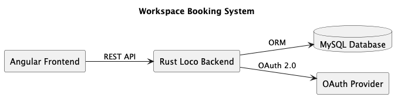
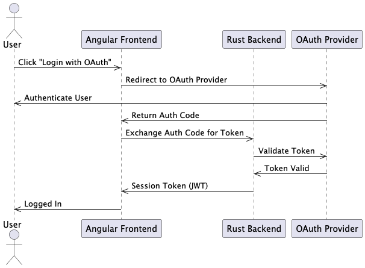
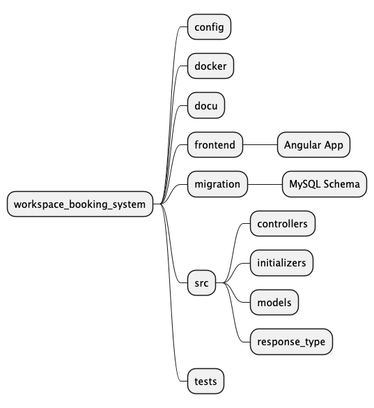

# Working Space Booking System


A full-stack **workspace booking management system** built with **Rust (Loco + SeaORM)** on the backend, **Angular** for
the frontend, **Bootstrap** for UI styling, **MySQL** for database storage, and **OAuth** for secure login.

---

## Features

- **Workspace Booking**: Users can browse, book, and manage workspaces.
- **Authentication & Authorization**: OAuth-based secure login (e.g., Google, GitHub).
- **Modern UI**: Built with Angular and styled using Bootstrap.
- **Database Integration**: Uses MySQL as the primary data store.
- **Rust Backend**:
    - **Loco** framework for robust API development.
    - **SeaORM** for database ORM and query management.
- **RESTful API**: Well-structured endpoints for frontend-backend communication.

---

## Tech Stack

- **Backend**: Rust, [Loco](https://github.com/loco-rs/loco), [SeaORM](https://www.sea-ql.org/SeaORM/)
- **Frontend**: Angular, Bootstrap
- **Database**: MySQL
- **Authentication**: OAuth (Authentik/custom)

---

## Architecture



## OAuth Flow


⸻

## Project Structure


⸻

# Installation & Setup

## Prerequisites

- Rust (latest stable)
- Node.js & npm
- MySQL server
- OAuth credentials from your provider

# Docker Setup

## Prerequisites

- Build your docker image
- Run with Docker Compose

```
docker-compose up --build
```

This will start:
• Rust backend API
• Angular frontend
• MySQL database

Update .env files before running. Example with Authentik please customize.
```
OAUTH_CLIENT_ID="workspace-booking"
OAUTH_CLIENT_SECRET=""
AUTH_URL="http://localhost:9000/application/o/authorize/"
TOKEN_URL="http://localhost:9000/application/o/token/"
REDIRECT_URL="http://localhost:5150/api/oauth2/authentik/callback/cookie"
PROFILE_URL="http://localhost:9000/application/o/userinfo/"
PROTECTED_URL="http://localhost:5150/"

```
---


# Development
## Steps

1. Clone Repository

```
git clone https://github.com/Martin1088/workingspace_booking_system.git
cd workingspace_booking_system
```

3. Database
- Create a MySQL database and update connection details in config/development.yaml configuration.
- Setup database mrbs
```
mysql -u root mrbs < backup.sql
```
- Run migrations (SeaORM).

4. OAuth
- Configure OAuth credentials in config/development.yaml .env.

5. Backend Setup

```
cargo loco start
```


6. Frontend Setup

```
cd ../frontend
npm build
```

---

# API Endpoints

POST /auth/login - OAuth login
GET /
POST /
GET /

---

License

MIT License

---