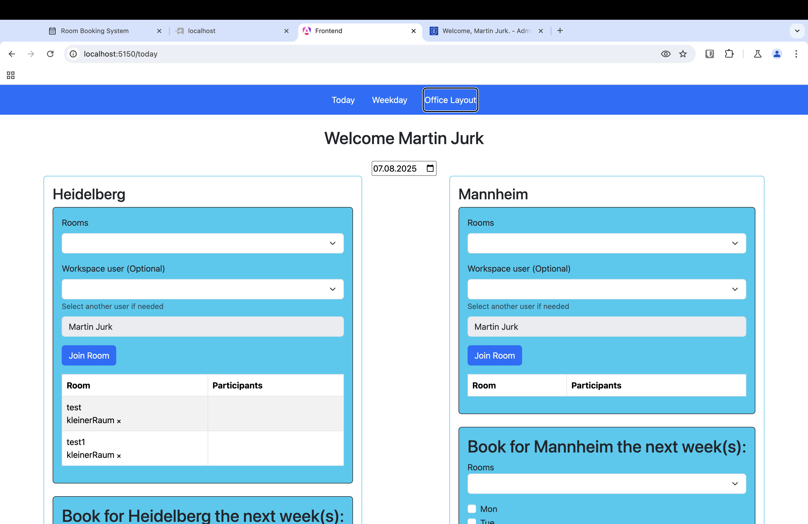

# Working Space Booking System


A full-stack **workspace booking management system** built with **Rust (Loco + SeaORM)** on the backend, **Angular** for
the frontend, **Bootstrap** for UI styling, **MySQL** for database storage, and **OAuth** for secure login.

Based on [MRBS](https://github.com/meeting-room-booking-system/mrbs-code) a classic PHP application for booking meeting rooms, rewritten and simplyfied for managing workspaces.
Before flexible working for all departmental employees across all sites was hindered by limitations in the existing room booking system. 
Additionally, the booking procedure itself was time-consuming and did not allow for spontaneous reservations, reducing overall efficiency and flexibility.

Now it is a modern and fast webservice.

---

---
## Features

- **Workspace Booking**: Users can browse, book, and manage workspaces.
- **Authentication & Authorization**: OAuth-based secure login (e.g., Google, GitHub).
- **Modern UI**: Built with Angular and styled using Bootstrap.
- **Database Integration**: Uses MySQL as the primary data store.
- **Rust Backend**:
    - **Loco** framework for robust API development.
    - **SeaORM** for database ORM and query management.
- **RESTful API**: Well-structured endpoints for frontend-backend communication.

---

## Tech Stack

- **Backend**: Rust, [Loco](https://github.com/loco-rs/loco), [SeaORM](https://www.sea-ql.org/SeaORM/)
- **Frontend**: Angular, Bootstrap
- **Database**: MySQL
- **Authentication**: OAuth (Authentik/custom)

---

## Architecture


## OAuth Flow


⸻

## Project Structure


⸻

# Installation & Setup

## Prerequisites

- Rust (latest stable)
- Node.js & npm
- MySQL server
- OAuth credentials from your provider

# Kubernetes / Helm

This project provides a Helm chart under `charts/workspace-booking`.

Secrets are not managed by Helm and must be created beforehand.

See:
- [Helm chart](docu/kubernetes.md)

# Docker Setup

## Prerequisites

Update .env files before running.
```
OAUTH_CLIENT_ID="workspace-booking"
OAUTH_CLIENT_SECRET=""
AUTH_URL="http://localhost:9000/application/o/authorize/"
TOKEN_URL="http://localhost:9000/application/o/token/"
REDIRECT_URL="http://localhost:5150/api/oauth2/authentik/callback/cookie"
PROFILE_URL="http://localhost:9000/application/o/userinfo/"
PROTECTED_URL="http://localhost:5150/"
ADMIN_GROUPS="authentik Admins,workspace-booking-admins"
```
Example with Authentik please customize.
```
OAUTH_CLIENT_ID=""
OAUTH_CLIENT_SECRET=""
AUTH_URL="https://<your-domain-authentik>/application/o/authorize/"
TOKEN_URL="https://<your-domain-authentik>/application/o/token/"
REDIRECT_URL="https://<your-domain-web>/api/oauth2/authentik/callback/cookie"
PROFILE_URL="https://<your-domain-authentik>/application/o/userinfo/"
PROTECTED_URL="https://<your-domain-web>/"
ADMIN_GROUPS="authentik Admins,workspace-booking-admins"

```
Example with EntraID please customize.
```
OAUTH_CLIENT_ID=""
OAUTH_CLIENT_SECRET=""
AUTH_URL="https://login.microsoftonline.com/<Directory (tenant) ID>/oauth2/v2.0/authorize"
TOKEN_URL="https://login.microsoftonline.com/<Directory (tenant) ID>/oauth2/v2.0/token"
REDIRECT_URL="https://<your-domain-web>/api/oauth2/authentik/callback/cookie"
PROFILE_URL="https://graph.microsoft.com/oidc/userinfo"
PROTECTED_URL="https://<your-domain-web>/"
ADMIN_GROUPS="workspace-booking-admins"
```
[Azure Cloud config](docu/azure.md)
Customize your docker-compose.yaml
```
docker compose up
```

This will start:
- Rust backend API
- Angular frontend
- MySQL database

---


# Development
## Steps

1. Clone Repository

```
git clone https://github.com/Martin1088/workingspace_booking_system.git
cd workingspace_booking_system
```

2. Database
- Create a MySQL database and update connection details in config/development.yaml configuration.
- Setup database mrbs
```
mysql -u root mrbs < backup.sql
```
- Run migrations (SeaORM).

3. OAuth
- Configure OAuth credentials in config/development.yaml .env.

4. Backend Setup

Set the envirnment variables  .cargo/config.toml. Like this example

```
[env]
DATABASE_URL="mysql://<user>:<password>@localhost:<port>/mrbs"
OAUTH_CLIENT_ID=""
OAUTH_CLIENT_SECRET=""
AUTH_URL="http://localhost:9000/application/o/authorize/"
TOKEN_URL="http://localhost:9000/application/o/token/"
REDIRECT_URL="http://localhost:5150/api/oauth2/authentik/callback/cookie"
PROFILE_URL="http://localhost:9000/application/o/userinfo/"
PROTECTED_URL="http://localhost:5150/"
AUTH_TYPE="request_body"
[alias]
loco = "run --"
loco-tool = "run --"

playground = "run --example playground"
```
then:
```
cargo loco start
```


6. Frontend Setup

```
cd ../frontend
npm build
```

---

# API Endpoints

## Authentication

| Method | Endpoint                               | Description                    |
|--------|----------------------------------------|--------------------------------|
| POST   | `/api/auth/register`                   | Register new user             |
| POST   | `/api/auth/login`                      | Login with OAuth              |
| GET    | `/api/auth/verify/{token}`             | Verify email/token            |
| POST   | `/api/auth/forgot`                     | Request password reset        |
| POST   | `/api/auth/reset`                      | Reset password                |
| GET    | `/api/auth/current`                    | Get current user info         |
| POST   | `/api/auth/magic-link`                 | Request login via magic link  |
| GET    | `/api/auth/magic-link/{token}`         | Authenticate with magic link  |

---

## OAuth Integration

| Method | Endpoint                                              | Description                   |
|--------|-------------------------------------------------------|-------------------------------|
| GET    | `/api/oauth2/authentik`                               | Start OAuth login             |
| GET    | `/api/oauth2/authentik/callback/cookie`               | Callback for Authentik login  |
| GET    | `/api/oauth2/protected`                               | Access protected resource     |

---

## Admin: Room & Area Management

| Method | Endpoint                               | Description                    |
|--------|----------------------------------------|--------------------------------|
| POST   | `/api/admin/createroom`                | Create a new room              |
| POST   | `/api/admin/updateroom/{id}`           | Update existing room           |
| DELETE | `/api/admin/deleteroom/{id}`           | Delete room                    |
| POST   | `/api/admin/createarea`                | Create new area                |
| DELETE | `/api/admin/deletearea/{id}`           | Delete area                    |

---

## Booking & Overview

| Method | Endpoint                               | Description                            |
|--------|----------------------------------------|----------------------------------------|
| DELETE | `/api/delete/joinroom/{id}`            | Cancel a room booking                  |
| POST   | `/api/update/joinroom_id`              | Update booking by room ID              |
| POST   | `/api/update/joinroom_via_entry_id`    | Update booking by entry ID             |
| POST   | `/api/update/joinrooms_dates`          | Update multiple booking dates          |
| POST   | `/api/read/overviewday`                | Daily booking overview                 |
| POST   | `/api/read/overviewweek`               | Weekly booking overview                |
| GET    | `/api/read/users`                      | Retrieve list of users                 |

---

##  Utility

| Method | Endpoint     | Description            |
|--------|--------------|------------------------|
| GET    | `/_ping`     | Ping check             |
| GET    | `/_health`   | Health check           |
---

License

MIT License

---